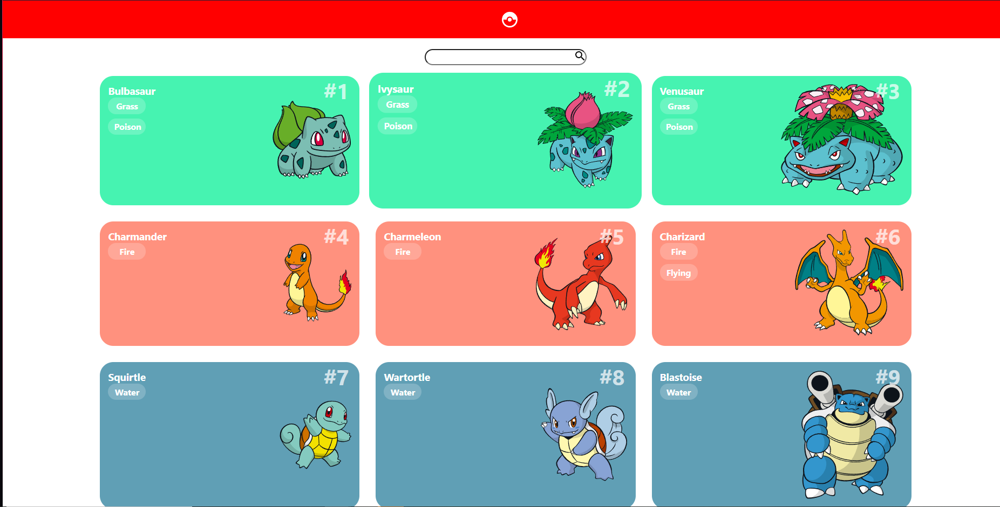
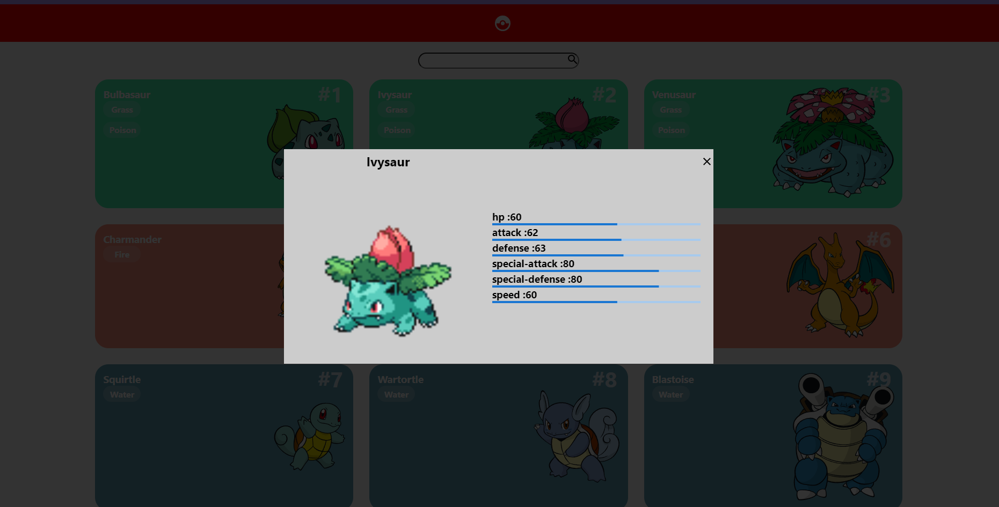
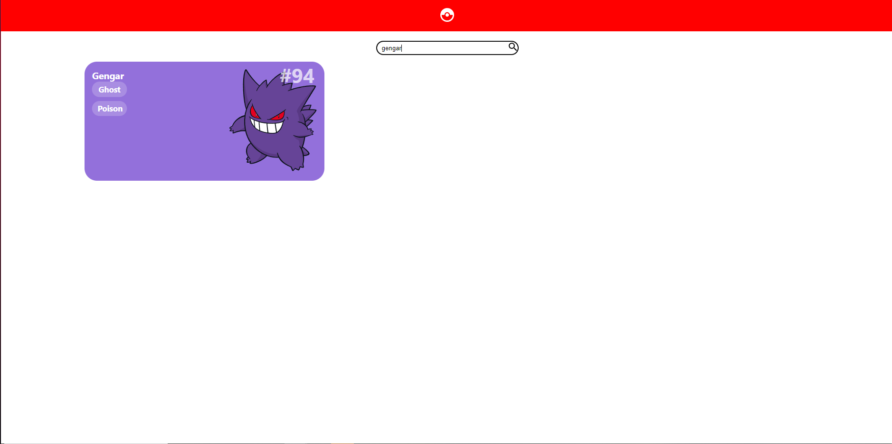

<div id="top"></div>


## Sobre o projeto


<div align="center"><a href="#top">
 


                                                    

>Esse projeto e uma pokedex desenvolvida com ReactJS, a api consumida foi a PokeAPI.
</a></div>

<a href="https://pokedex-react-mikael.netlify.app"target="_blank">
    
  </a>

<p align="left">(<a href="https://pokedex-react-mikael.netlify.app" target="_blank">Clique aqui para abrir um demontraçâo</a>)</p>


##🚀 Tecnologias


* ReactJs
* Hooks
* Styled-Components
* React hooks                                                                                        
* Axios
* Material UI
  


<p align="right">(<a href="#top">back to top</a>)</p>


<


### Como usar

2. Clone o repositorio
   ```sh
   git clone https://github.com/MikaelSantos1/pokedex.git
   ```
3. Instale as  depencias
   ```sh
  npm install
   ```
4. Inicie o projeto
   ```js
   npm start
   ```

<p align="right">(<a href="#top">back to top</a>)</p>
